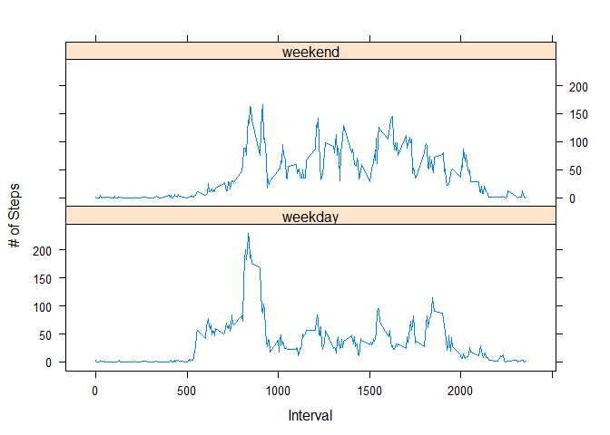

Loading and preprocessing the data
----------------------------------

We set the working directory followed by downloading the dataset from
its url and unzipping the file to "step\_data.csv". The data comes from
Roger Pengs github account.

    setwd("~/Coursera/Reproducibile Research/Week_2/RepData_PeerAssessment1")
    url <- "https://d396qusza40orc.cloudfront.net/repdata%2Fdata%2Factivity.zip"
    destfile <- "step_data.zip"
    download.file(url, destfile)
    unzip(destfile)
    act_data <- read.csv("activity.csv", sep = ",", stringsAsFactors = FALSE)

Explorarory Analysis w/ variable names and the structure of the file are
given by

    act_data$day <- weekdays(as.Date(act_data$date), abbreviate = FALSE)
    act_data$date_time <- as.POSIXct(act_data$date, format= "%Y-%m-%d")
    names(act_data)

    ## [1] "steps"     "date"      "interval"  "day"       "date_time"

    str(act_data)

    ## 'data.frame':    17568 obs. of  5 variables:
    ##  $ steps    : int  NA NA NA NA NA NA NA NA NA NA ...
    ##  $ date     : chr  "2012-10-01" "2012-10-01" "2012-10-01" "2012-10-01" ...
    ##  $ interval : int  0 5 10 15 20 25 30 35 40 45 ...
    ##  $ day      : chr  "Monday" "Monday" "Monday" "Monday" ...
    ##  $ date_time: POSIXct, format: "2012-10-01" "2012-10-01" ...

    ##removing NAS from the data
    act_data1 <- act_data[!is.na(act_data$steps),]

What is mean total number of steps taken per day?
-------------------------------------------------

Calculate the total number of steps taken per day

    ##summarizing total steps per date
    act_table_sum <- aggregate(act_data1$steps ~ act_data1$date, FUN = sum)
    colnames(act_table_sum) <- c("Date", "Steps")

Make a histogram of the total number of steps taken each day \#make a
histogram of the total \# of steps taken each day

    hist(act_table_sum$Steps, main ="Total # of Steps Per Day", xlab = "Steps", col = "red", breaks = 5)

Calculate and report the mean and median of the total number of steps
taken per day

    #calculate the mean of the total # of steps taken per day
    as.integer(mean(act_table_sum$Steps))

    ## [1] 10766

    #calculate the median of the total # of steps taken per day
    as.integer(median(act_table_sum$Steps))

    ## [1] 10765

The average \# of steps taken each day was 10766. The median \# of steps
taken each day was 10765.

What is the average daily activity pattern?
-------------------------------------------

Make a time series plot (i.e. type = "l") of the 5-minute interval
(x-axis) and the average number of steps taken, averaged across all days
(y-axis)

    ##load libraries plyr & ggplot
    library(plyr)
    library(ggplot2)

    ## Warning: package 'ggplot2' was built under R version 3.4.4

    ##removing NAS from the data
    act_data1 <- act_data[!is.na(act_data$steps),]
    inv_table <- ddply(act_data1, .(interval), summarize, Avg = mean(steps))

    ##create line plot og avg. # of step per interval
    time_plot <- ggplot(inv_table, aes(x = interval, y= Avg), xlab = "Interval", ylab= "Avg. # of Steps")
    time_plot + geom_line() + xlab("Interval") + ylab ("Avg. # of Steps") + ggtitle("Average Number of Steps per Interval")

Which 5-minute interval, on average across all the days in the dataset,
contains the maximum number of steps?

    ##maximum steps by interval
    max_steps <- max(inv_table$Avg)
    round(max_steps, digits = 0)

    ## [1] 206

    ##which interval contains the maximum avg. # of steps
    inv_table[inv_table$Avg == max(max_steps),1]

    ## [1] 835

The maximum number of steps for a 5-minute interval was 206 steps.

The 5-minute interval which had the maximum number of steps was the 835
interval.

Imputing missing values
-----------------------

Calculate and report the total number of missing values in the dataset
(i.e. the total number of rows with NAs)

    #calculate and report the total number of missing values
    sum(is.na(act_data))

    ## [1] 2304

So the original data set has 2304 rows with missing data.

We use a simple strategy for filling in all of the missing values in the
dataset. If a 5-minute interval has missing value, we use the mean for
that 5-minute interval.

We create a new data frame df\_impute that is equal to the original
dataset but with the missing data filled in (using mean for that
interval for imputation):

    df_act <- act_data
    miss_df <- is.na(df_act$steps)
    int_avg <- tapply(df_act$steps, df_act$interval, mean, na.rm = TRUE, simplify = T)
    df_act$steps[miss_df] <- int_avg[as.character(df_act$interval[miss_df])]

Make a histogram of the total number of steps taken each day and
calculate and report the mean and median total number of steps taken per
day

    new_daily <- tapply(df_act$steps, df_act$date, sum, na.rm = TRUE, simplify = T)
    hist(x = new_daily, col = "blue", breaks =20, xlab = "daily steps", ylab ="frequency", main = "The distribution of daily total w/ missing data imputed")

    #mean of new_daily
    round(mean(new_daily), digits = 0)

    ## [1] 10766

    #median of new_daily
    round(median(new_daily), digits = 0)

    ## [1] 10766

Based on the imputed data set, the new mean is 10766 and the new median
is 10766 . Compare with the original mean 10766 and median 10765 , the
mean doesn't change, and the median has a small change. Thus, the new
median becomes identical to the mean. One possible explanation is that
when we fill the missing data for the intervals, we use means for
intervals, so we have more data close or identical to the means, and
median is shifted and becomes identical to the mean. The overall shape
of the distribution has not changed.

Are there differences in activity patterns between weekdays and weekends?
-------------------------------------------------------------------------

Create a new factor variable in the dataset with two levels - "weekday"
and "weekend" indicating whether a given date is a weekday or weekend
day.

    #create a helper functions to decide if a day is a week day or not
    is_weekday <- function(d) {
            wd <- weekdays(d, abbreviate= FALSE)
            ifelse(wd == "Saturday" | wd == "Sunday", "weekend", "weekday")
    }
    wm <- sapply(df_act$date_time, is_weekday)
    df_act$wk <- as.factor(wm)

    ##make a panel plot containing a time series plot
    wk_df <- aggregate(steps ~ wk + interval, data = df_act, FUN = mean)

    library(lattice)

    ## Warning: package 'lattice' was built under R version 3.4.4

    xyplot(steps ~ interval | factor(wk), layout = c(1,2), xlab="Interval", ylab= "# of Steps", type ="l", data= wk_df)

\#\#Yes, the step activity trends are different based on whether the day
occurs on a weekend or not. This may be due to people having an
increased opportunity for activity beyond normal work hours for those
who work during the week.
